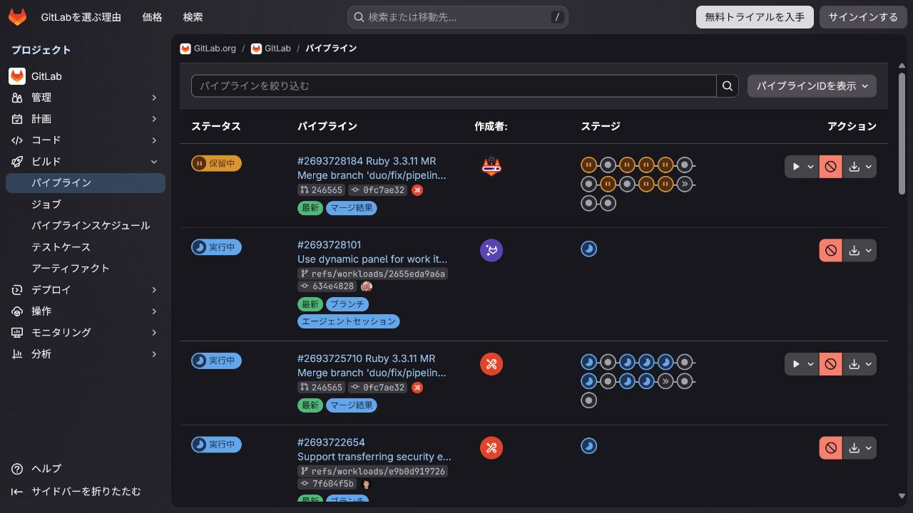
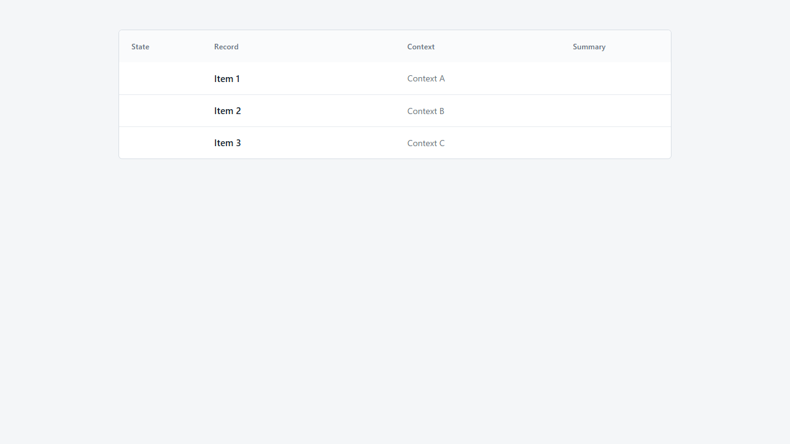

# Experiment 004 Phase 2A human review

## Status

**human review required**

This is a bounded source-independence experiment, not a clone or pixel-fidelity
assessment. The original, historic result, and new result are shown solely so a
human reviewer can assess whether the retained abstraction is useful.

## Experiment conditions

| Item | Fixed value |
| --- | --- |
| Phase 1 baseline | `6b477dcde357a790d70cad6724cebb61b40d540a` |
| Source-blind Manifest | [`source-blind-manifest.md`](source-blind-manifest.md), SHA-256 `8BBFAE4430CD689DA09E57371B759F362945734B723BD7A80800B1BC374CE968` |
| Source-blind implementation requirements | [`implementation-requirements.md`](implementation-requirements.md), SHA-256 `59B571C34E565010C442F03712432FEB70E1749BD2E6979635213780B7074025` |
| Historic source-blind apply packet | [`../apply-packet.md`](../apply-packet.md), SHA-256 `1184141AB6F241AC98B6A05830F184D4BB9B6BA60EBCD30FAD9BCFF180B477A8` |
| Profile | `profile/ui-profile.md`, SHA-256 `B164BDB2545D507B84944E1B78845E646563A8323B221998206FB0ABB3CFA98E` |
| Extraction prompt | `prompts/extract-from-existing-ui.md`, SHA-256 `C86B2C2E285B539BD89660A0CE35A504ADA5C3E2F3A7C6C29A242558ADACD537` |
| Apply prompt | `prompts/apply-manifest.md`, SHA-256 `64656E894A6F291FEBFAE5787DAA198EE1536304FFDE094735DFF3E698AE3C79` |
| Implementer model / reasoning | User-configured default model; no model or reasoning override |
| Independent handoff review | P0/P1: none; `IMPLEMENTER_MAY_START=true` |

### Implementer allowlist and observed access

| Allowlisted and actually opened input | SHA-256 |
| --- | --- |
| `profile/ui-profile.md` | `B164BDB2545D507B84944E1B78845E646563A8323B221998206FB0ABB3CFA98E` |
| `prompts/apply-manifest.md` | `64656E894A6F291FEBFAE5787DAA198EE1536304FFDE094735DFF3E698AE3C79` |
| `source-blind-manifest.md` | `8BBFAE4430CD689DA09E57371B759F362945734B723BD7A80800B1BC374CE968` |
| `implementation-requirements.md` | `59B571C34E565010C442F03712432FEB70E1749BD2E6979635213780B7074025` |

The Implementer report records `prohibited_inputs_used: []`. No original UI,
URL, source-aware trace, calibration material, historic implementation/review,
or external search was an allowed Implementer input.

## Comparison material

### Limited original evaluation scope

This is evaluation-only evidence. It establishes the limited result-table scope;
it was not supplied to the Implementer. Page-level chrome, product semantics,
destinations, controls, and responsive behavior are out of scope.

### Historic result under the earlier rule

This is the prior source-aware calibration result, retained without modification.
Its visual proximity is not a success criterion for this experiment.

### New source-blind initial result — wide

This is the fixed first implementation from only the four allowlisted inputs.

### New source-blind initial result — narrow

The permitted narrow behavior retains the table and uses horizontal overflow; it
does not claim a general responsive policy.

## Evaluator summary

See the full evidence-led comparison in
[`evaluator-comparison.md`](evaluator-comparison.md).

| Dimension | Evaluator finding |
| --- | --- |
| Source independence | Supported by the exact opened-file list, empty prohibited-input record, candidate leak scan, and neutral output. It is evidence of the recorded boundary, not proof of unobservable worker state. |
| Intent preservation | Structural hierarchy, header/row alignment, scan order, density, restrained separation, and primary-record prominence are preserved. Cell-level grouping for state and summary is only partially demonstrated because those cells correctly remain empty. |
| Abstraction quality | Partial: roles and relationships remain; state, identity, summary, destinations, responsive behavior, and accessibility are explicitly unresolved rather than fabricated. |
| Application quality | Partial: the table is readable and natural as a bounded specimen, but deliberately sparse because target-product data was not authorized. |
| Unsupported invention | None found: visible fixtures are neutral and required; presentation decisions are local mechanics; no product state, action, copy, link, or hierarchy slot was added. |
| Difference from historic result | The historic calibration's higher resemblance materially depended on source-aware populated role cues. Lower resemblance here is expected, not by itself a defect. |

## Final information-loss classification

| Observed difference | Historic → source-blind result | Relevant Manifest boundary | Classification | Severity | Improvement needed / owner | Improve without restoring source? |
| --- | --- | --- | --- | --- | --- | --- |
| Product wording, record values, and destination-specific labels become neutral fixtures or empty cells | populated/domain-specific → neutral/empty | Product content and destinations are not Manifest facts | 2. Target product decides; Manifest not needed | medium | Yes; target-product requirements | yes |
| Original identity, address, provider terminology, evidence identifiers, and capture details do not appear | source-specific → excluded | No source facts or evidence references in application inputs | 3. Original-specific; intentionally excluded | none | No; extraction boundary | yes |
| State meaning and grouped-summary values cannot be rendered | populated state/marks → reserved empty cells | State/summary must not be invented and color alone is insufficient | 4. Must remain unresolved | high | Yes; target-product state/summary model | yes |
| Identity representation cannot be assessed beyond secondary context text | rich/specific representation → text-only | Identity form/content is product-owned | 2. Target product decides; Manifest not needed | medium | Yes; target-product requirements | yes |
| Cell-level state/summary grouping is weakly evidenced when cells are empty | visible grouping → empty reservation | Role order and grouping are retained, but no values are authorized | 9. Fixture or evaluation-environment difference | medium | Optional; neutral non-semantic fixture strategy / evaluator | yes |
| Historic result carries detailed visual geometry and palette that the new result does not reproduce | concrete styling → relational styling | Density, contrast, hierarchy, and separation are qualitative | 10. Evaluation criterion biased toward clone accuracy | low | No for this experiment; evaluation rubric | yes |
| The source-blind packet does not tell a product how to provide missing state/summary/identity inputs | implicit source cues → explicit unresolved boundary | Manifest intentionally excludes product facts | 6. Source-blind artifact discoverability gap | medium | Yes; packet/template owner | yes |
| No discrepancy was found that requires a source-specific pixel value, product structure, or copy to be added back | n/a | Abstract roles and responsibilities remain sufficient for the bounded slice | 1, 5, 7, and 8 not evidenced by this fixed run | n/a | No change justified | yes |

No improvement action may expose the original to the Implementer or add an
original screenshot to the application inputs.

## Important unresolved matters

- Target-product state meanings, bindings, labels, update triggers, and
  assistive behavior.
- Identity representation and grouped-summary values.
- Destinations, focus and interaction behavior, accessibility requirements, and
  general responsive policy.
- Whether an intentionally sparse neutral specimen is sufficient evidence for a
  subsequent experiment.

## Human decision questions

Please decide each question independently.

1. Does application without seeing the original still convey the table's primary design intent?
2. Is the new result natural as a read-only operational result table?
3. Is the loss from excluding original-specific information acceptable?
4. Is there additional intent that should be abstracted into the Manifest?
5. Which differences should remain product-owned rather than Manifest content?
6. Does any unsupported invention prevent acceptance?
7. May this extraction/application method proceed to the next experiment?

### Required final decision

Choose exactly one:

- `accepted`
- `conditionally accepted` — record the conditions that must be met before the next experiment.
- `rejected`
