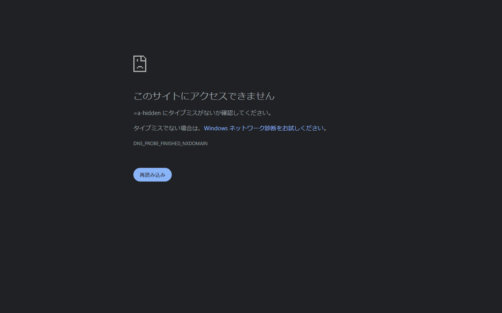

# Evaluator record — attempt 2

## Method and boundary

Stage 1 was completed and frozen in [generated-image-reextraction-attempt-2.md](generated-image-reextraction-attempt-2.md) before any text input was read. This record then compared that immutable visual record only with `manifest.md`, `application-input-contract.md`, and `apply-instruction.md`, followed by `pattern-evidence.md`. The implementation HTML/CSS and the prior evaluator/re-extraction/human-review records were not read. This evaluation is therefore source-blind; it cannot establish implementation semantics from pixels.

## A-hidden image-observation discrepancy

The frozen Stage 1 observation records no visible Header, title, or controller in `A-hidden.png`. A parent independent original-resolution inspection of this exact worktree image reports a dark Header across the top approximately 64 pixels, a hamburger control near x=39/y=34, and `Workspace` near x=77/y=34. These observations conflict. The frozen Stage 1 record is preserved unchanged; Pattern A therefore requires human review rather than an unqualified machine failure.

## Input comparison

| Check | Status | Observation |
| --- | --- | --- |
| A-open Header/controller witness | preserved/partial | The Header, `Workspace`, and a leading hamburger-shaped control are visible; the control's accessible name, relationship, and behavior are unresolved from the image. |
| A-hidden exact Header/controller requirement | conflicted / human review required | The frozen Stage 1 record found no Header/title/controller, while a parent original-resolution inspection reports a dark Header, hamburger control, and `Workspace` at the top of the exact same image. The Contract requirement cannot be machine-resolved from this conflicting evidence. |
| A-hidden fully hidden Drawer | preserved | No Drawer is visible. |
| B-open Pattern B ownership | preserved/partial | The Header has no visible Drawer trigger; a hamburger-shaped visible control is in the Drawer below the Header. Its semantic placement/relationship is unresolved from pixels. |
| B-rail Pattern B closure | preserved/partial | A rail, its visible control, and two visible shortcut icons are present. The icon meanings and ARIA state are unresolved from pixels. |
| No leading icons in expanded rows | preserved | A-open, B-open, and wide show no leading icons in expanded navigation rows. |
| Trailing expanded chevron | preserved | The expanded `Parent A` row visibly has a trailing down chevron. |
| Square navigation rows | preserved | The visible current row appears square-cornered. |
| Neutral fixture | preserved/partial | Visible title, labels, current accent, and no caption/badge/count/status are consistent. Semantic identity of current/non-current rows is image-unverifiable. |
| Unsupported invention | not observed | No image-visible unsupported behavior, breakpoint, animation, focus, keyboard, persistence, caption, badge, count, permission, status, or product identity was observed. Behavioral absence is not proof. |
| Source independence | preserved | The comparison remained source-blind; no implementation source was inspected. |
| Semantic round-trip | unresolved | Pixels cannot prove the declared accessible names, `aria-expanded`, `aria-controls`, controlled IDs, or sole-controller semantics. |
| `wide.png` / `narrow.png` viewport policy | not exercised | They are captures only. They do not establish a viewport-to-mode mapping. |

## Pattern-evidence comparison

| Pattern case | Status | Comparison |
| --- | --- | --- |
| Required A: Header trigger + fully hidden closure | conflicted / human review required | The frozen Stage 1 record reports the Header/controller absent; a parent original-resolution inspection of the exact same image reports them present. The Drawer closure is visible, but the retained Header trigger requires human adjudication. |
| Required B: Drawer control + icon rail closure | preserved/partial | The expanded and rail images visibly retain a Drawer-region control; the rail visibly retains two icon shortcuts. Semantics remain unresolved. |
| Optional adaptive candidate | not exercised | `wide.png` and `narrow.png` show different static captures but are not viewport-policy evidence. |
| Always-visible persistent Drawer with no close control | not applicable | This case is explicitly outside the open/close ownership comparison and is not depicted. |

## Decision

**HUMAN_BLOCKER — human review required.** Machine observations conflict over whether `A-hidden.png` contains the required retained Header/controller. Adjudicate the image before accepting or rejecting Pattern A; do not change the Contract merely to resolve the discrepancy. A source/assistive-technology check is also needed before accepting the claimed semantic round-trip for either policy.
