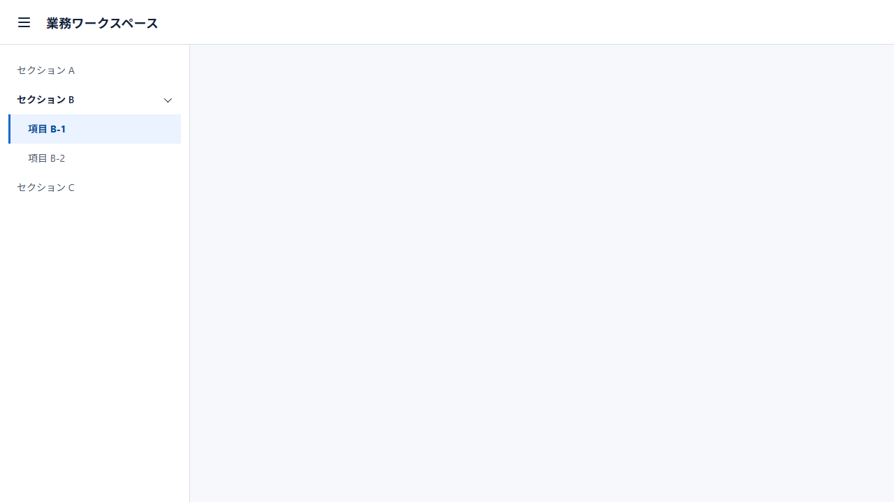
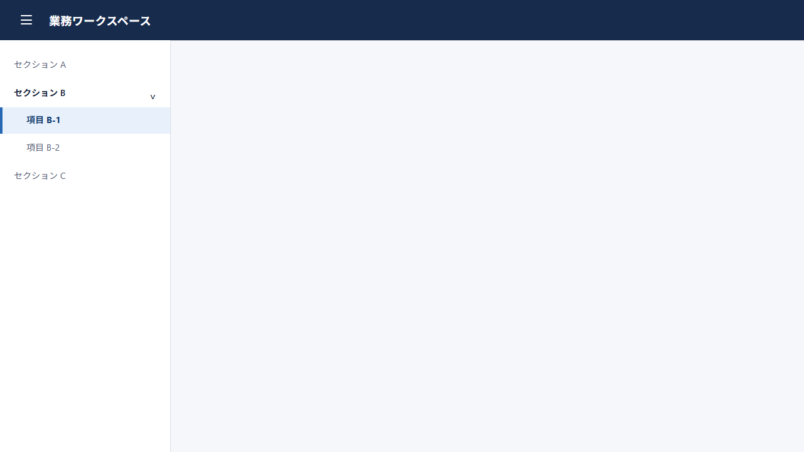
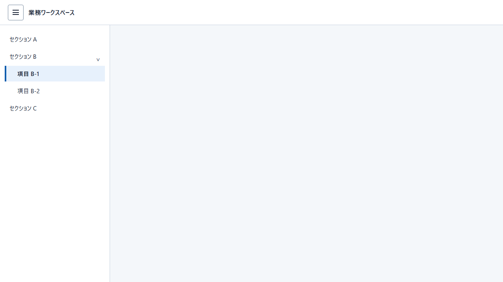

# 共通Header／Drawer 新規作成テスト: Terra medium 3回

## デフォルトManifest

このテストで使用した入力は、[デフォルトManifestのsnapshot](consumer-input/design-manifest/manifest.md)です。

## 使用プロンプト全文

> 業務アプリで再利用する共通シェルを作成してください。
>
> - 作成対象は共通HeaderとDrawerだけです。検索、一覧、読取、追加、編集、削除などの業務画面・画面遷移は作成しません。
> - Headerには `業務ワークスペース` を表示します。
> - Headerの先頭側にDrawerを開閉する制御を置きます。
> - Drawerの表示状態と非表示状態の両方を確認できる静的HTMLにしてください。`?drawer=open` と `?drawer=hidden` のどちらでも初期状態を表示できるようにします。
> - Drawerの固定fixtureは次です。`セクション A`、展開中の親 `セクション B`、子 `項目 B-1`（現在位置）、子 `項目 B-2`、`セクション C`。親には末尾側の展開状態アイコンを表示してください。
> - 現在位置は文字列の状態説明を追加せず、左端のアクセントと文字のウェイトで識別します。選択面の角は直角です。
> - Drawerを非表示にしたとき、空のDrawer境界や残存余白を残しません。
> - テーマはライトオンリーです。テーマ選択UIは表示しません。
> - 外部画像、外部フォント、外部CDN、外部scriptは使用しません。

## 結果

### Run 1

[HTML: Drawer表示](runs/run-1/index.html?drawer=open) · [HTML: Drawer非表示](runs/run-1/index.html?drawer=hidden)

### Run 2

[HTML: Drawer表示](runs/run-2/index.html?drawer=open) · [HTML: Drawer非表示](runs/run-2/index.html?drawer=hidden)

### Run 3

[HTML: Drawer表示](runs/run-3/index.html?drawer=open) · [HTML: Drawer非表示](runs/run-3/index.html?drawer=hidden)

