# 共通Header／Drawer 新規作成テスト: Terra medium 3回

## 生成条件

- Model: `gpt-5.6-terra`
- Reasoning effort: `medium`
- Runs: `3`

## デフォルトManifest

このテストで使用した入力は、[デフォルトManifestのsnapshot](consumer-input/design-manifest/manifest.md)です。

## 使用プロンプト全文

> 業務アプリで再利用する共通シェルを作成してください。
>
> - 作成対象は共通HeaderとDrawerだけです。検索、一覧、読取、追加、編集、削除などの業務画面・画面遷移は作成しません。
> - Headerには `業務ワークスペース` を表示します。
> - Headerの先頭側にDrawerを開閉する制御を置きます。
> - Drawerの表示状態と非表示状態の両方を確認できる静的HTMLにしてください。`?drawer=open` と `?drawer=hidden` のどちらでも初期状態を表示できるようにします。
> - Drawerの固定fixtureは次です。`セクション A`、展開中の親 `セクション B`、子 `項目 B-1`（現在位置）、子 `項目 B-2`、`セクション C`。親には末尾側の展開状態アイコンを表示してください。
> - 現在位置は文字列の状態説明を追加せず、左端のアクセントと文字のウェイトで識別します。選択面の角は直角です。
> - Drawerを非表示にしたとき、空のDrawer境界や残存余白を残しません。
> - テーマはライトとダークを切り替え可能にし、初期状態はライトにします。Headerの末尾側に、次のテーマへ切り替えるアイコンのみの制御を置きます。`?theme=light` と `?theme=dark` のどちらでも初期状態を表示できるようにします。可視の `Theme` または `テーマ` というキャプションは表示しません。
> - 配色は、Manifestの `theme-colors.default.yaml` にある該当モードの既定semantic role値だけを使います。選択テーマは、ページ・Header・Drawerを含む共有シェル全体のroot要素に適用します。Header自身に `surface_background` を背景、`text_primary` を文字、`border_subtle` を境界として明示適用し、親要素からの色継承に依存しません。Header制御は必要に応じて `border_interactive` を使います。独自のHeader色、brand色、または新しいリテラル色を追加しません。
> - 外部画像、外部フォント、外部CDN、外部scriptは使用しません。

## 結果

### Run 1

[HTML: Light / Drawer表示](runs/run-1/index.html?drawer=open&theme=light) · [HTML: Light / Drawer非表示](runs/run-1/index.html?drawer=hidden&theme=light) · [HTML: Dark / Drawer表示](runs/run-1/index.html?drawer=open&theme=dark) · [HTML: Dark / Drawer非表示](runs/run-1/index.html?drawer=hidden&theme=dark)

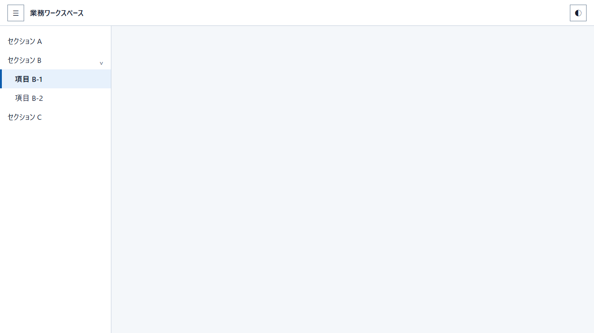

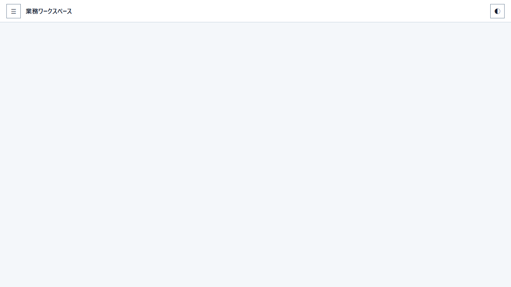

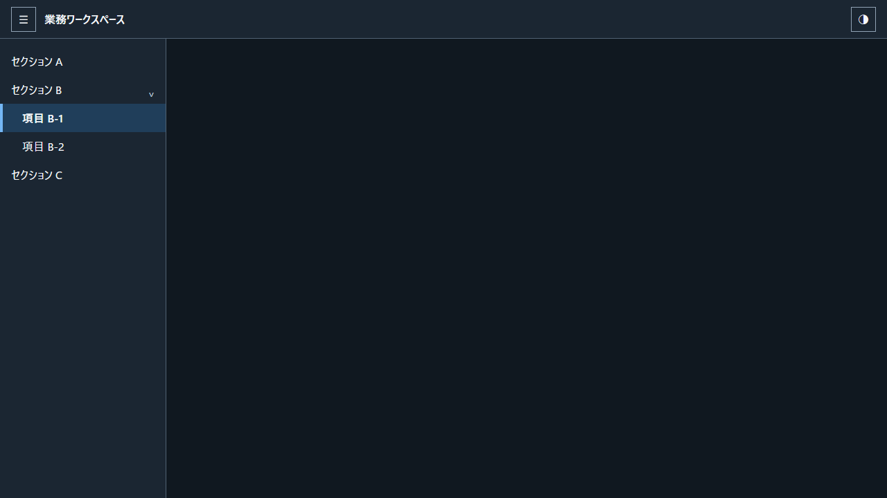

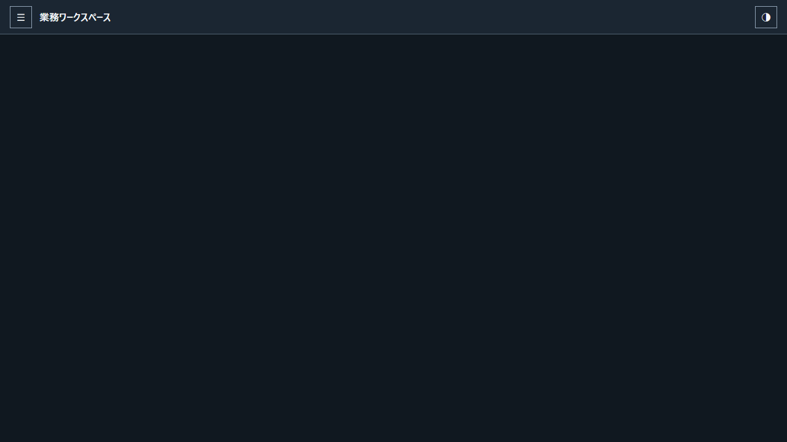

### Run 2

[HTML: Light / Drawer表示](runs/run-2/index.html?drawer=open&theme=light) · [HTML: Light / Drawer非表示](runs/run-2/index.html?drawer=hidden&theme=light) · [HTML: Dark / Drawer表示](runs/run-2/index.html?drawer=open&theme=dark) · [HTML: Dark / Drawer非表示](runs/run-2/index.html?drawer=hidden&theme=dark)

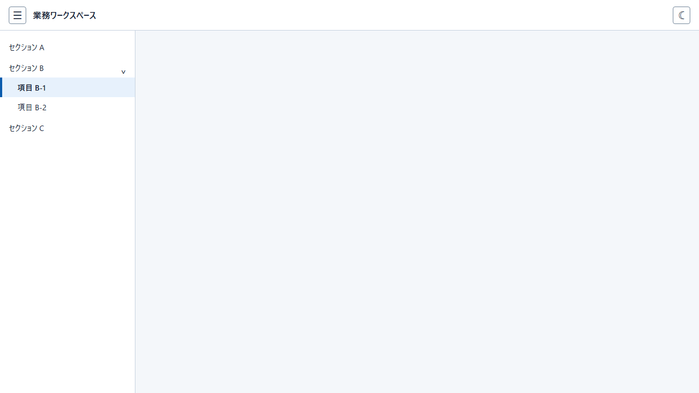

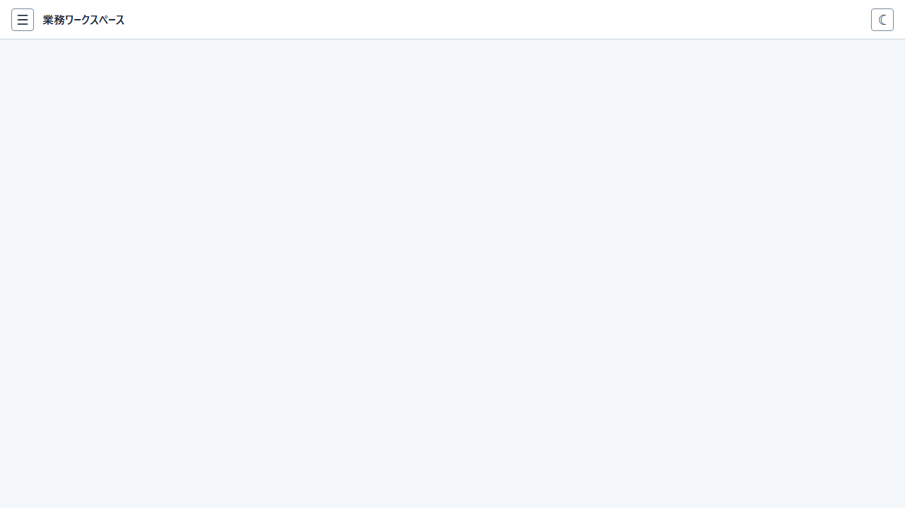

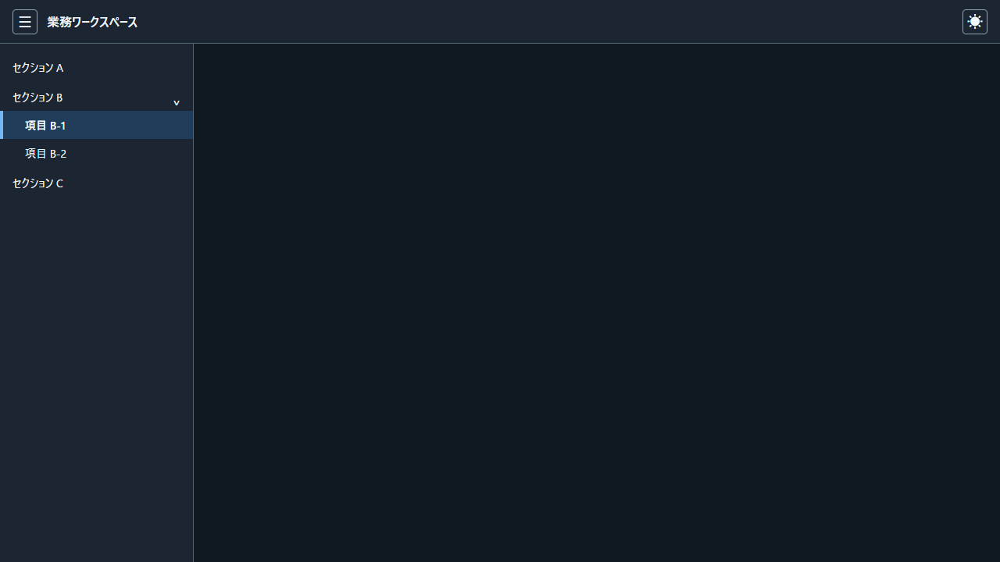

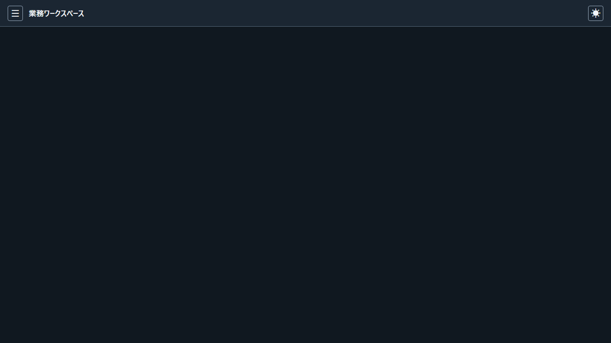

### Run 3

[HTML: Light / Drawer表示](runs/run-3/index.html?drawer=open&theme=light) · [HTML: Light / Drawer非表示](runs/run-3/index.html?drawer=hidden&theme=light) · [HTML: Dark / Drawer表示](runs/run-3/index.html?drawer=open&theme=dark) · [HTML: Dark / Drawer非表示](runs/run-3/index.html?drawer=hidden&theme=dark)

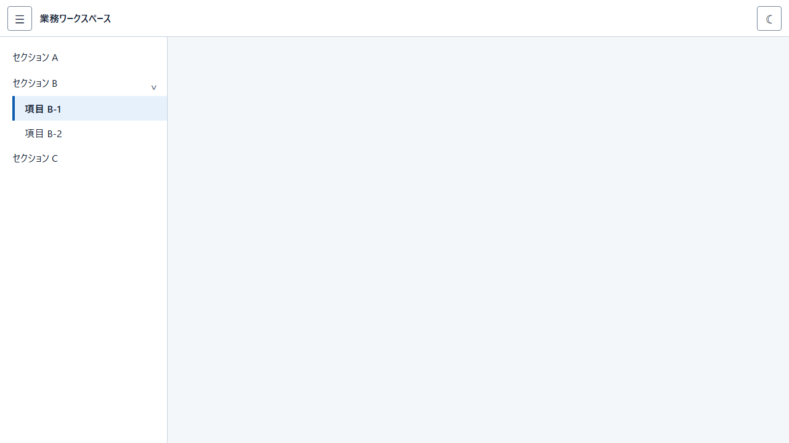

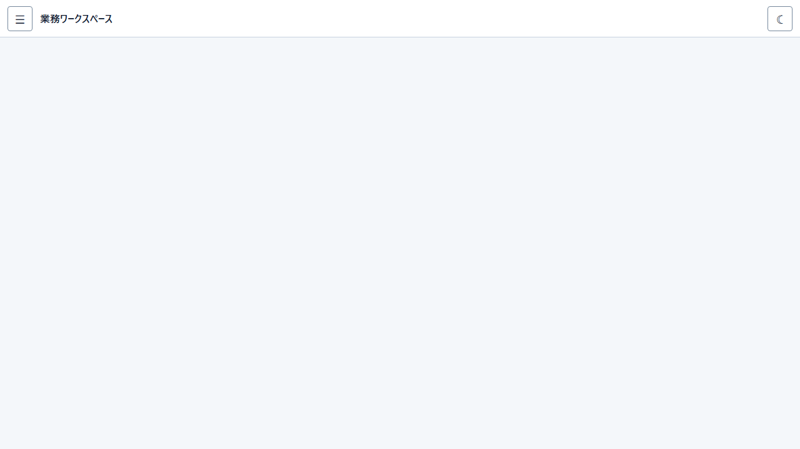

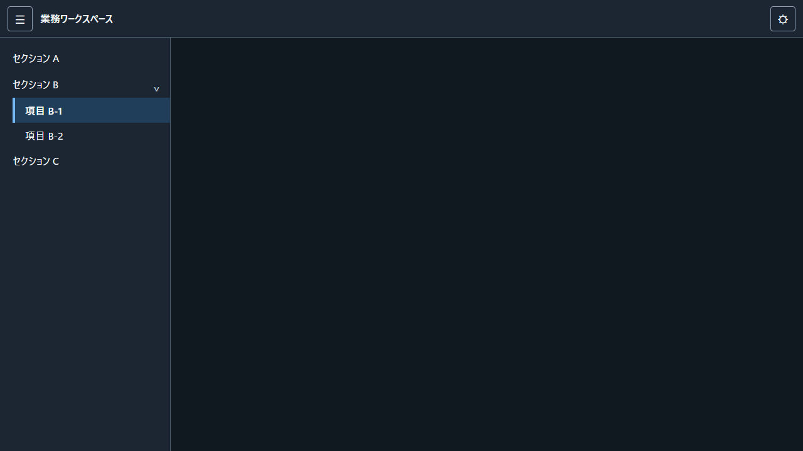

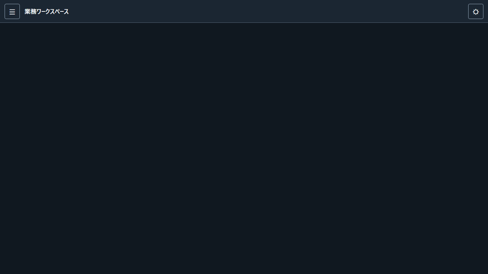
