# 固定共通シェルを使う顧客検索テスト: Terra medium 3回

## 生成条件

- Model: `gpt-5.6-terra`
- Reasoning effort: `medium`
- Runs: `3`

## デフォルトManifest

このテストで使用した入力は、[デフォルトManifestのsnapshot](consumer-input/design-manifest/manifest.md)と、[再利用した固定共通シェル Run 1](consumer-input/common-shell-run-1/index.html?drawer=open&theme=light)です。

## 使用プロンプト全文

> 既存の共通シェルを再利用して、顧客検索の静的HTMLを作成してください。
>
> - `common-shell-run-1/` は固定された共通Header／Drawerの実装です。この構造、Drawerの開閉、ライト／ダーク切替、HeaderとDrawerのsemantic roleによる配色を維持して、workspaceに顧客検索画面を追加してください。
> - 対象は顧客検索画面だけです。読取、追加、編集、削除、画面遷移は作成しません。
> - 画面名は `顧客検索`、説明は `登録済みの顧客情報を検索・確認します。` とします。不要な英語の上位ラベルや説明的なUI文言は追加しません。
> - 画像は表示しません。顧客IDは内部管理用の連番で編集不可です。管理項目は氏名、生年月日、住所、電話番号、メールアドレス、備考です。
> - 検索条件は氏名、生年月日、電話番号、メールアドレスです。SearchとClearを同じ操作領域に置きます。
> - 結果はグリッドで表示し、顧客IDを詳細確認のリンクとして左端に置きます。表示用の選択列、選択状態、行末の詳細操作は追加しません。行は6件の中立fixtureで構いません。
> - 検索結果には件数表示とページネーションを含めます。ページネーションは中立fixtureとして描画し、実データ接続やページ遷移は実装しません。
> - テーマは共通シェルと同じくライト／ダークを切り替え可能にし、初期状態はライトです。`?drawer=open|hidden` と `?theme=light|dark` のどちらでも初期状態を表示できるようにします。テーマ制御に可視の `Theme` または `テーマ` というキャプションは表示しません。
> - manifestにない新しい配色、brand色、設定、runtime、外部画像、外部フォント、外部CDN、外部scriptは追加しません。

## 結果

### Run 1

[HTML: Light / Drawer表示](runs/run-1/index.html?drawer=open&theme=light) · [HTML: Light / Drawer非表示](runs/run-1/index.html?drawer=hidden&theme=light) · [HTML: Dark / Drawer表示](runs/run-1/index.html?drawer=open&theme=dark) · [HTML: Dark / Drawer非表示](runs/run-1/index.html?drawer=hidden&theme=dark)

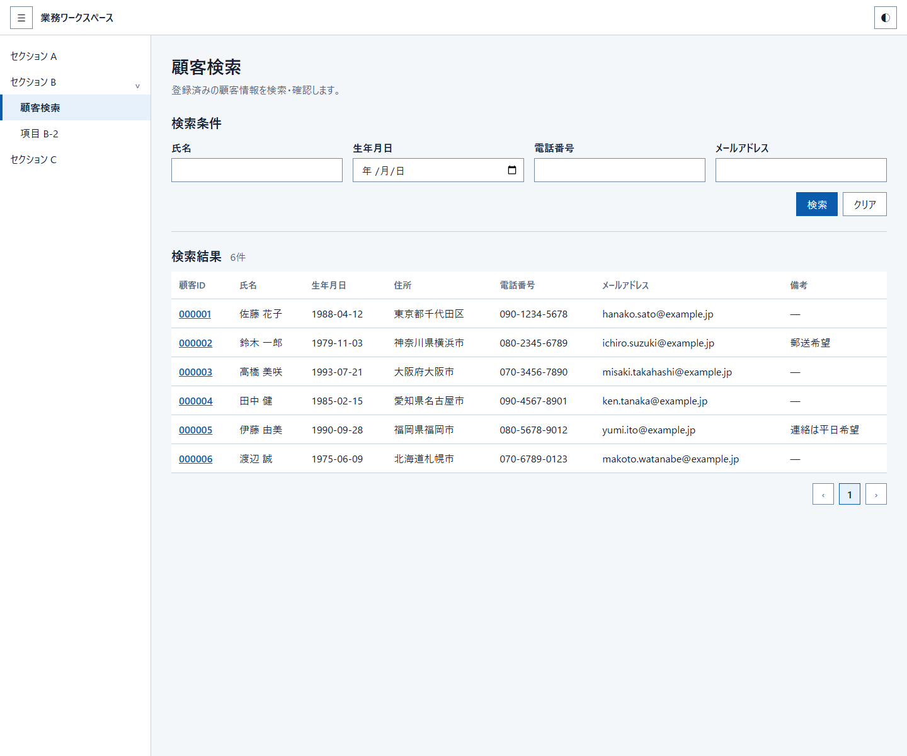
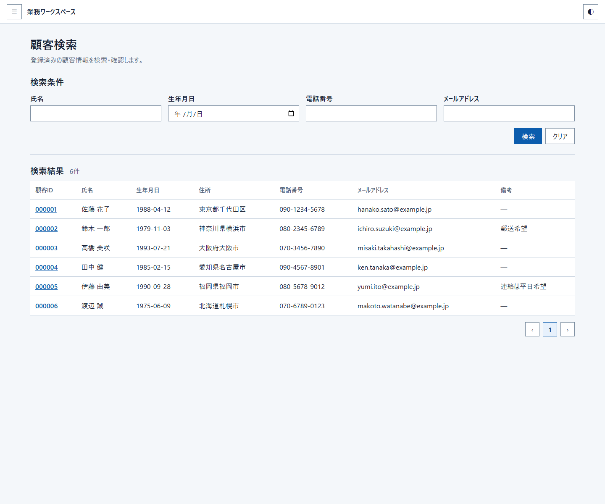
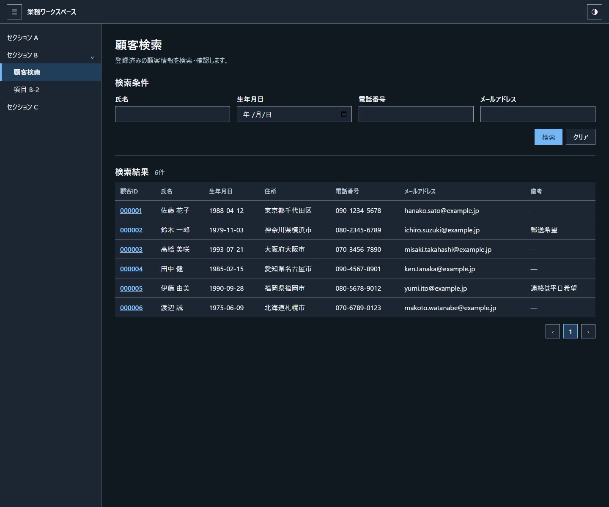
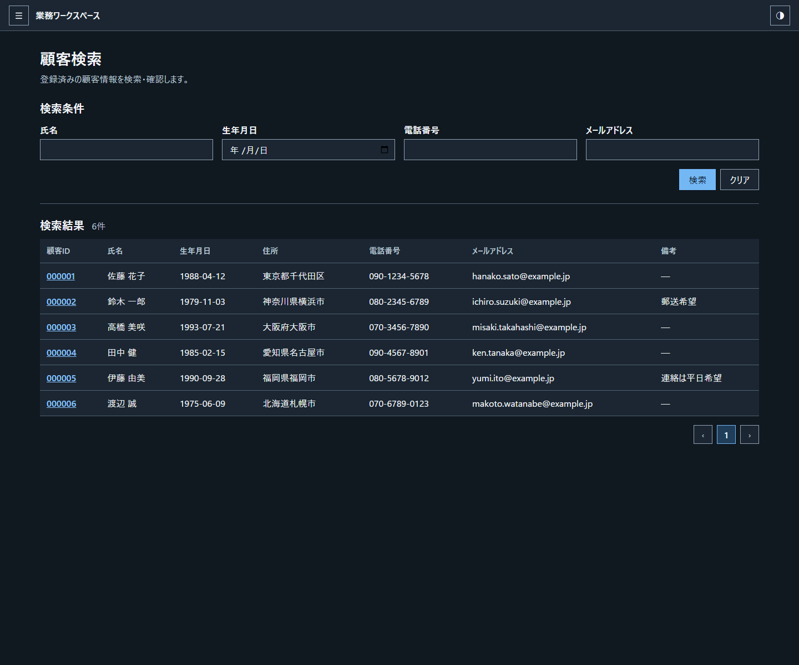

### Run 2

[HTML: Light / Drawer表示](runs/run-2/index.html?drawer=open&theme=light) · [HTML: Light / Drawer非表示](runs/run-2/index.html?drawer=hidden&theme=light) · [HTML: Dark / Drawer表示](runs/run-2/index.html?drawer=open&theme=dark) · [HTML: Dark / Drawer非表示](runs/run-2/index.html?drawer=hidden&theme=dark)

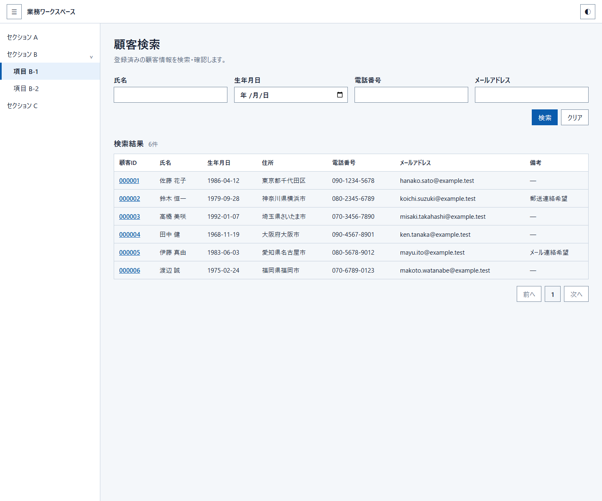
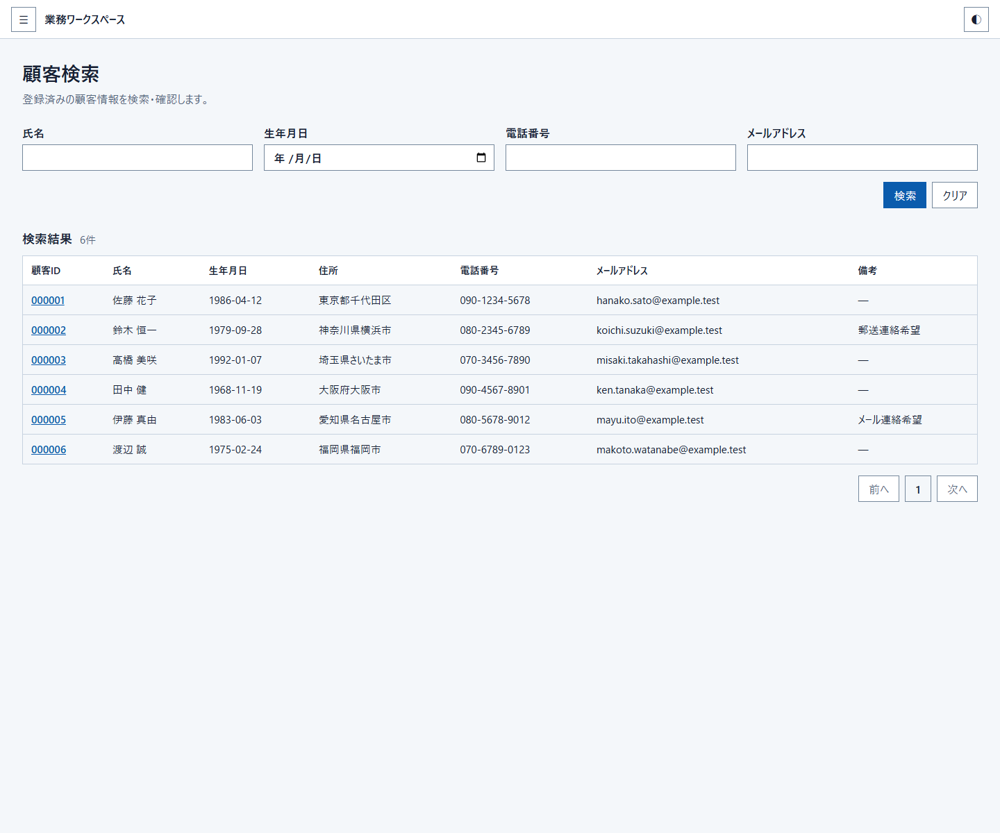
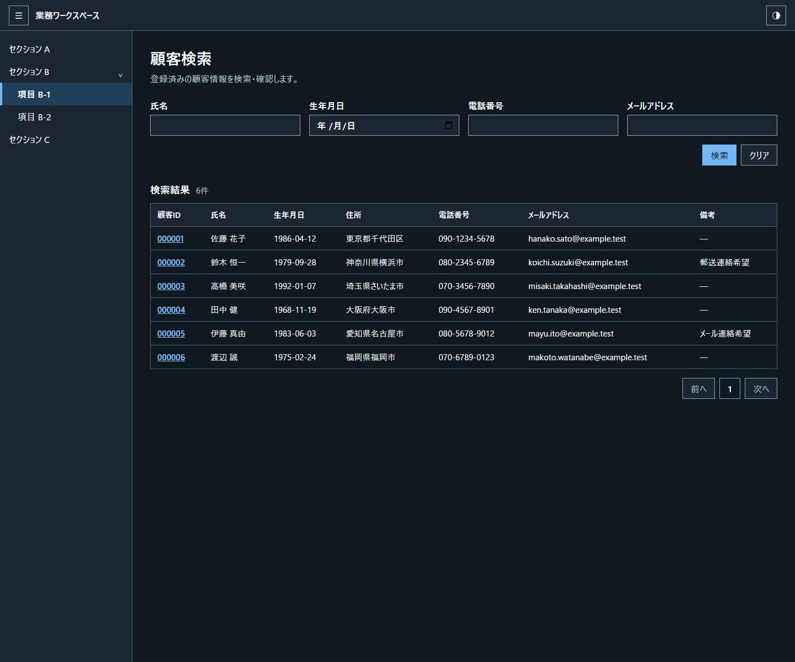
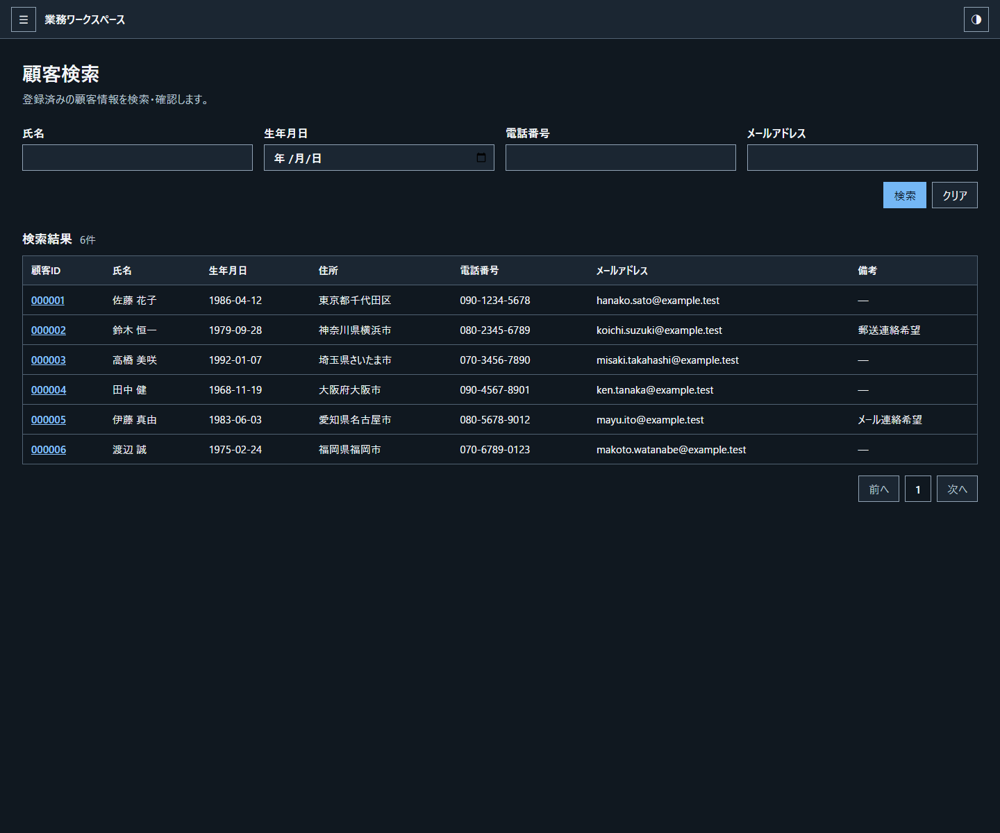

### Run 3

[HTML: Light / Drawer表示](runs/run-3/index.html?drawer=open&theme=light) · [HTML: Light / Drawer非表示](runs/run-3/index.html?drawer=hidden&theme=light) · [HTML: Dark / Drawer表示](runs/run-3/index.html?drawer=open&theme=dark) · [HTML: Dark / Drawer非表示](runs/run-3/index.html?drawer=hidden&theme=dark)

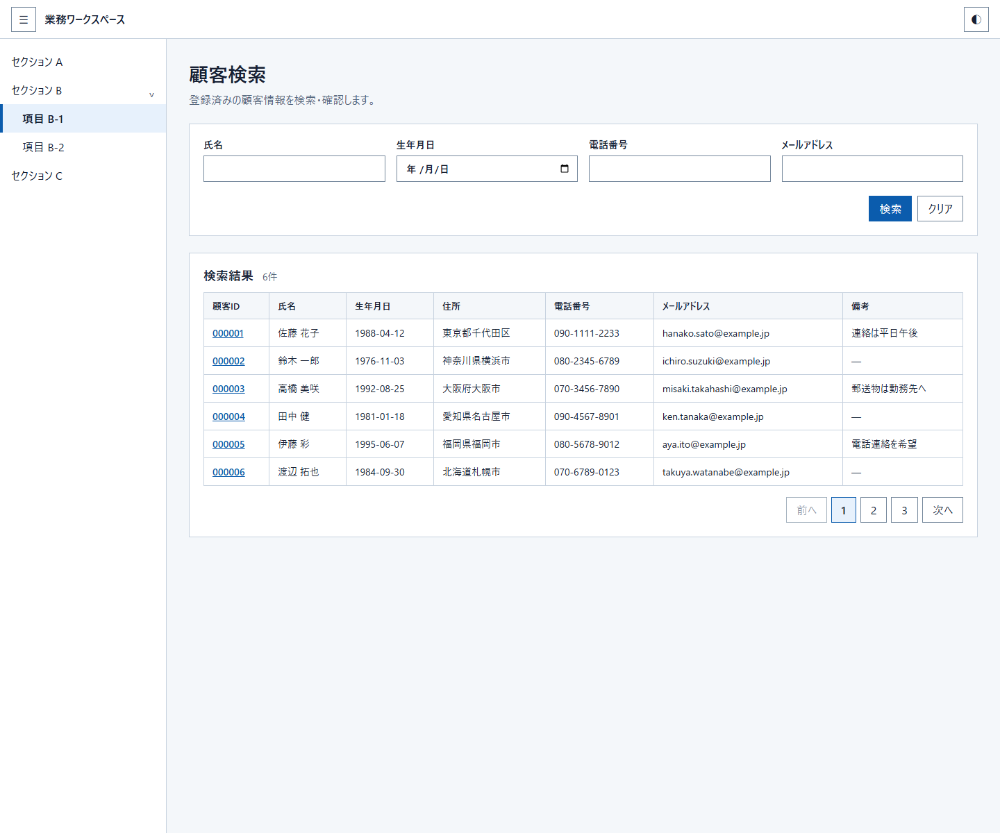
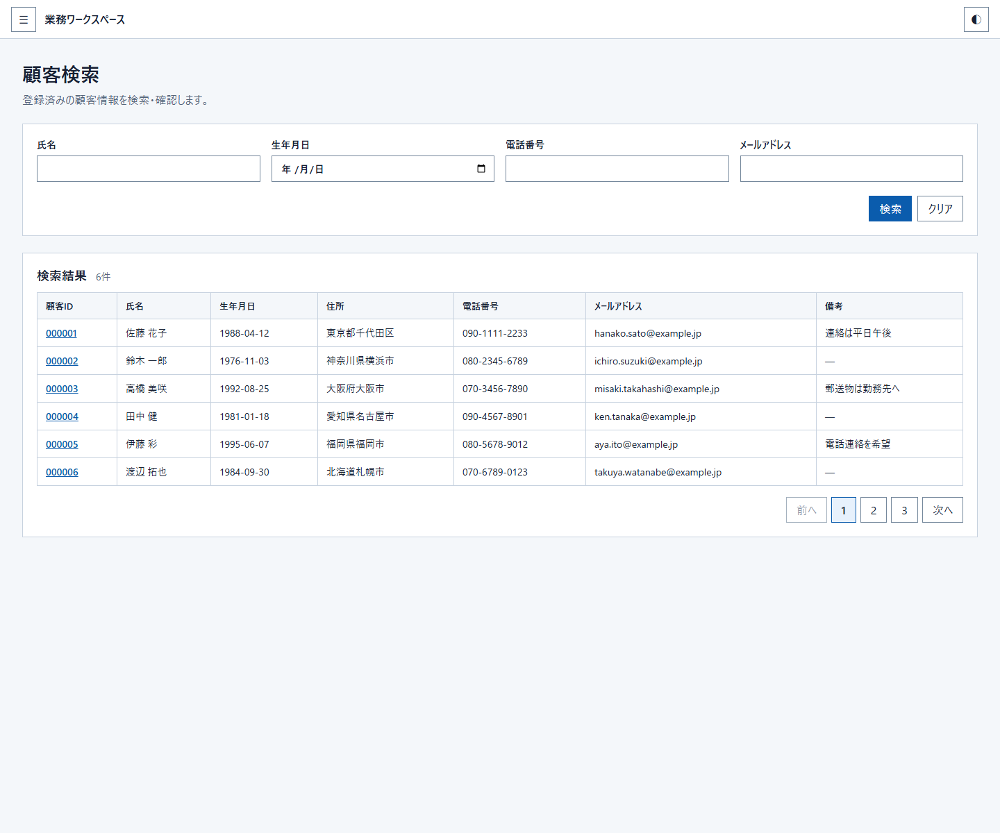
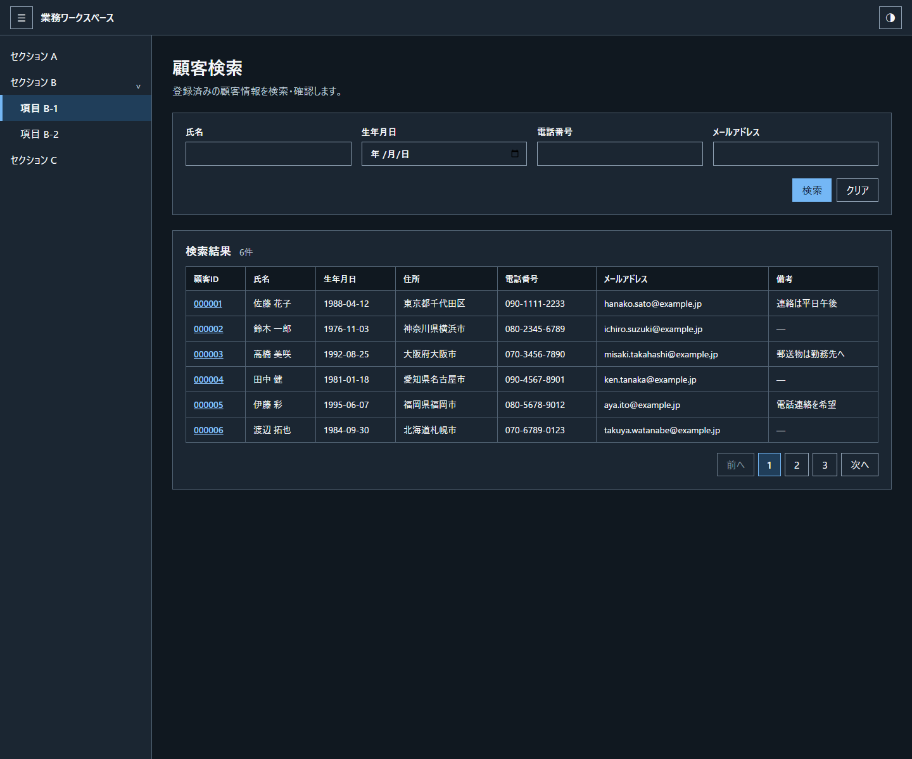
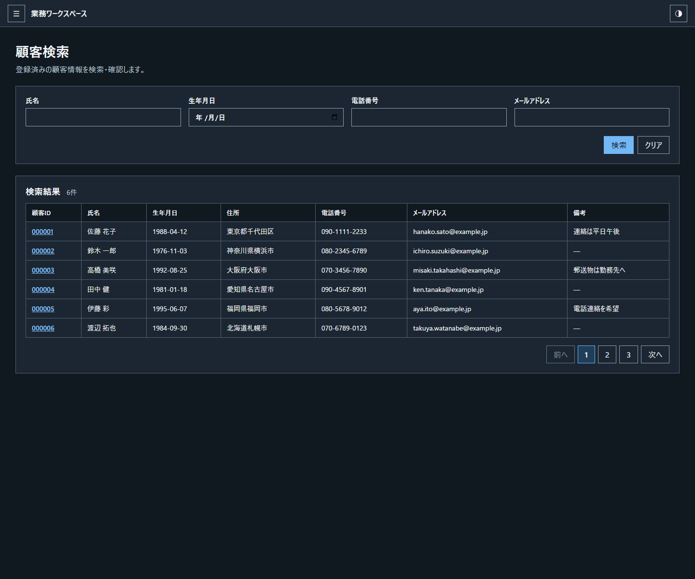
