# Manifest-only prompt retest: Terra medium three-run comparison

This retest uses the manifest snapshot after the action-row, result-collection
action, and result-grid body-surface clarifications. The consumer prompt
remains limited to screen-specific product facts.

## Generation conditions

- Model: `gpt-5.6-terra`
- Reasoning effort: `medium`
- Runs: `3`
- [Default Manifest snapshot](consumer-input/design-manifest/manifest.md)
- [Fixed common shell Run 1](consumer-input/common-shell-run-1/index.html?drawer=open&theme=light)

## Full user prompt

> 既存の共通シェルを再利用して、顧客検索の静的HTMLを作成してください。
>
> - 提供済みの共通シェルを再利用します。
> - 画面名は `顧客検索`、説明は `登録済みの顧客情報を検索・確認します。` とします。
> - 顧客IDは内部管理用の連番で編集不可です。検索対象は氏名、生年月日、電話番号、メールアドレスです。結果として氏名、生年月日、住所、電話番号、メールアドレス、備考を表示します。
> - 検索実行とリセットの操作が利用可能です。
> - 顧客IDを使った詳細確認が利用可能です。結果操作として `顧客を追加` が利用可能です。保存、実行、遷移、権限、結果は実装しません。
> - 結果は6件の中立fixtureとし、件数とページング能力があります。実データ接続やページ遷移は実装しません。
> - 画像は表示しません。

## Results

### Run 1

[HTML: Light / Drawer open](runs/run-1/index.html?drawer=open&theme=light) · [HTML: Light / Drawer hidden](runs/run-1/index.html?drawer=hidden&theme=light) · [HTML: Dark / Drawer open](runs/run-1/index.html?drawer=open&theme=dark) · [HTML: Dark / Drawer hidden](runs/run-1/index.html?drawer=hidden&theme=dark)

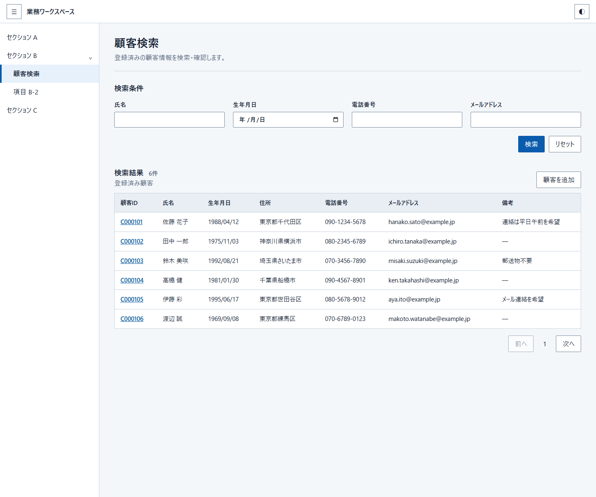
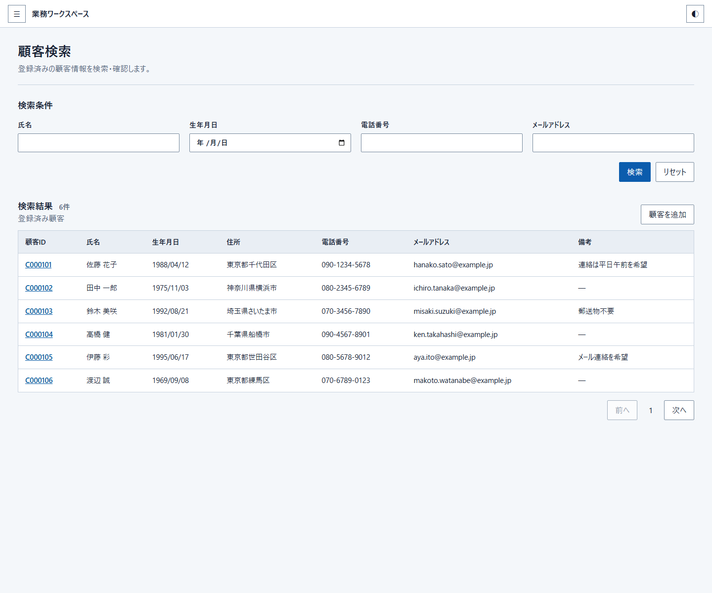
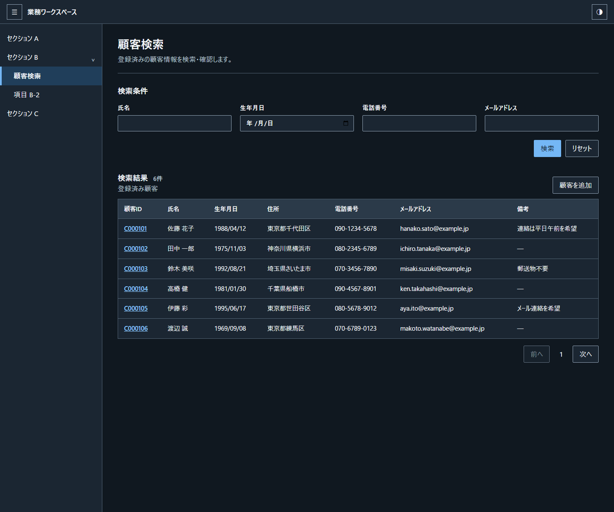
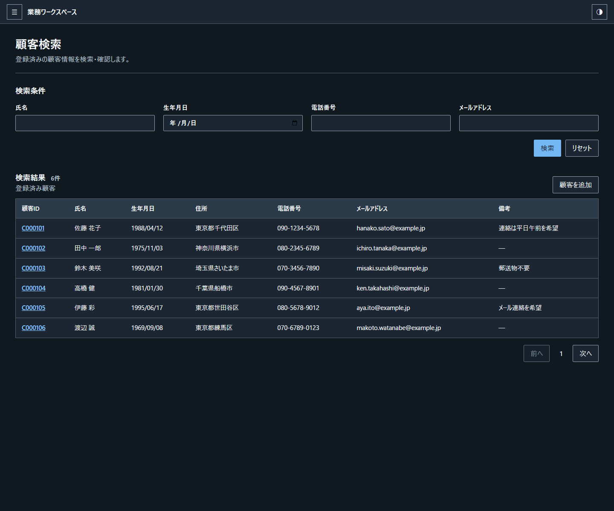

### Run 2

[HTML: Light / Drawer open](runs/run-2/index.html?drawer=open&theme=light) · [HTML: Light / Drawer hidden](runs/run-2/index.html?drawer=hidden&theme=light) · [HTML: Dark / Drawer open](runs/run-2/index.html?drawer=open&theme=dark) · [HTML: Dark / Drawer hidden](runs/run-2/index.html?drawer=hidden&theme=dark)

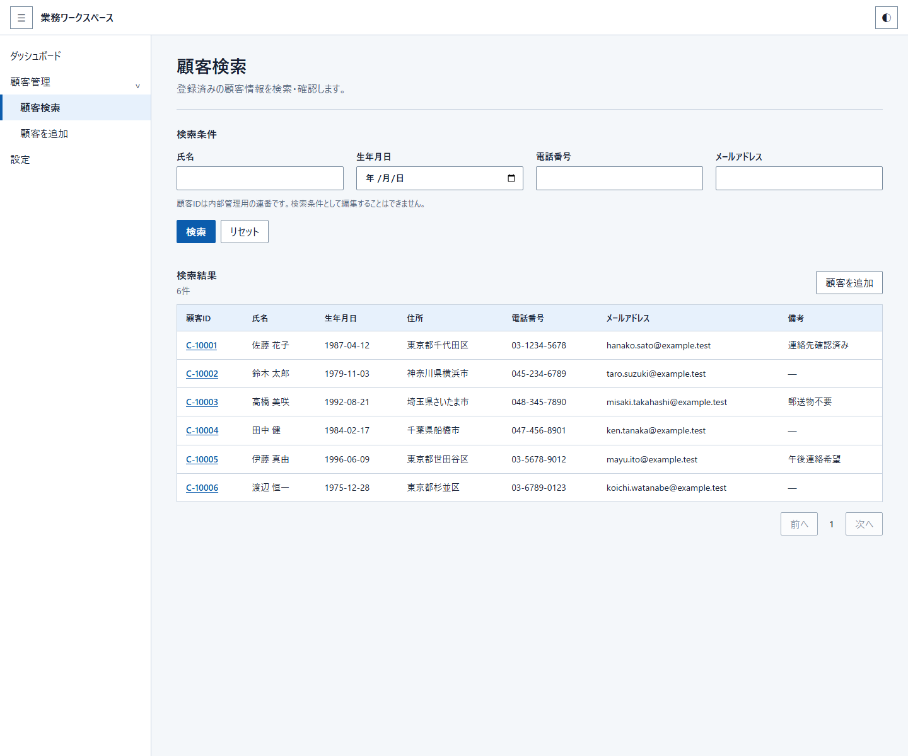
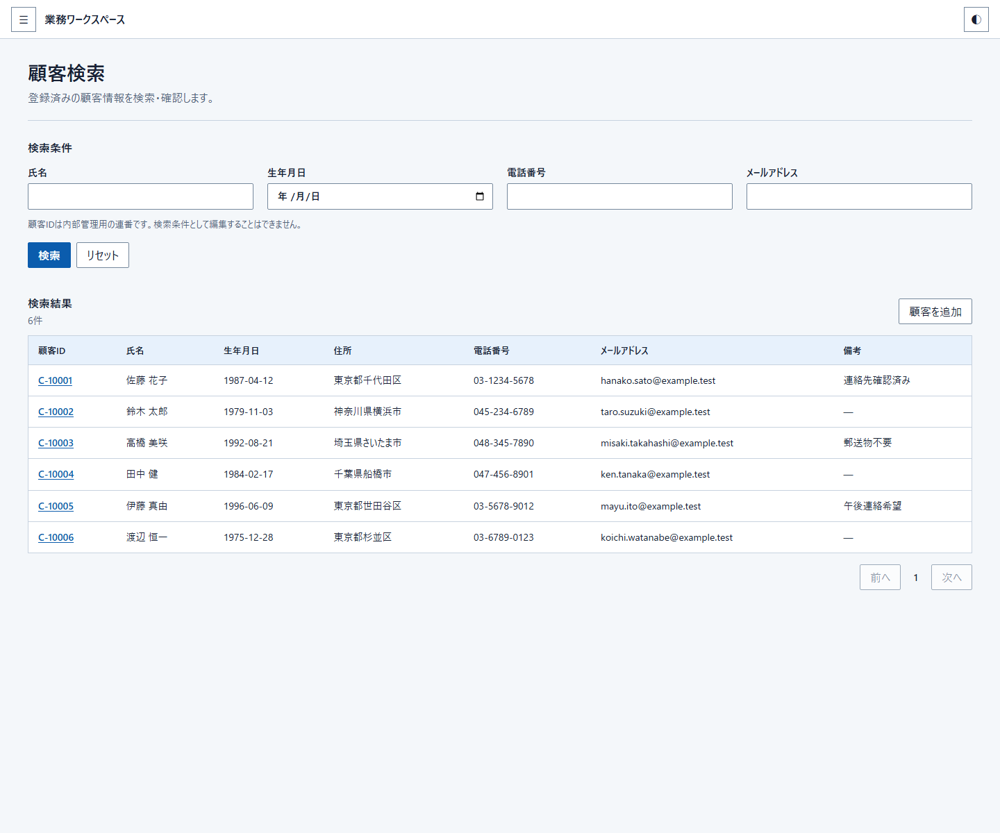
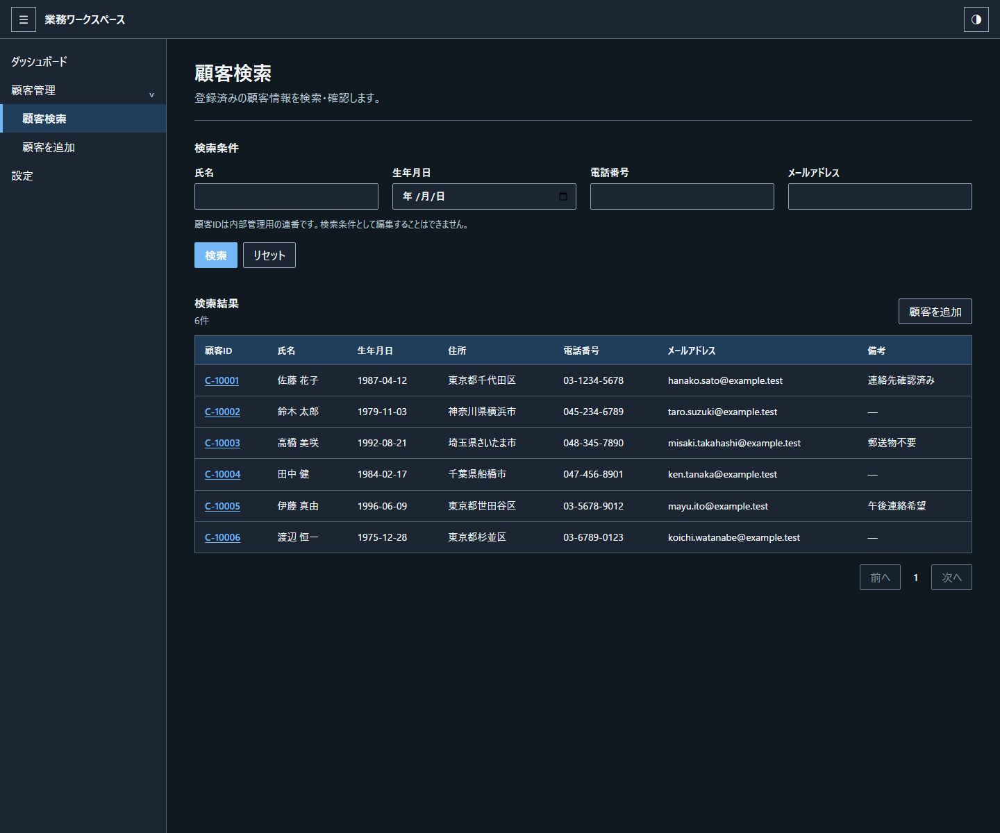
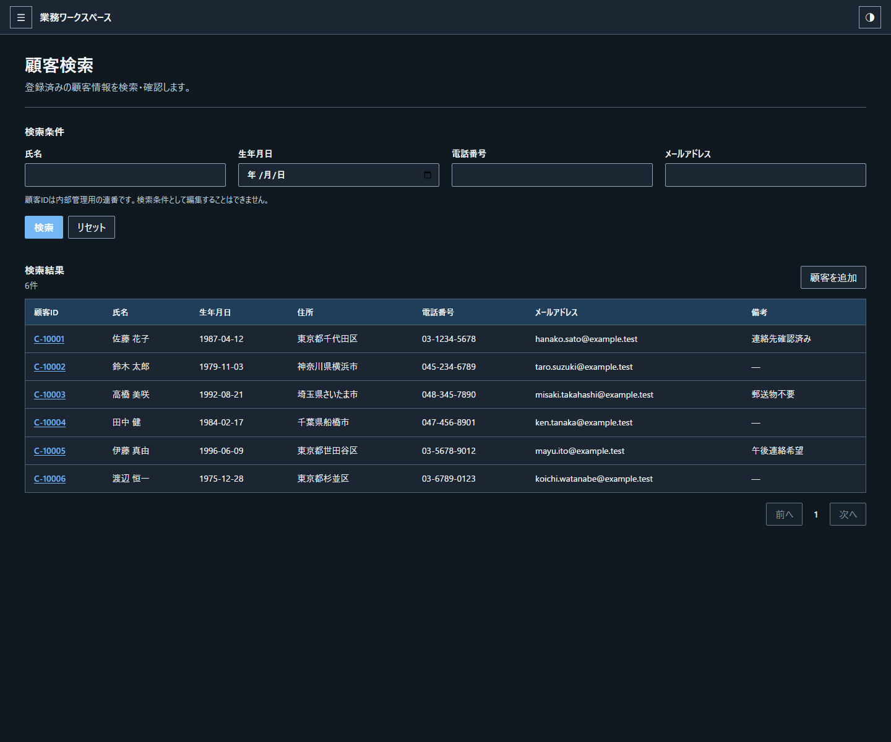

### Run 3

[HTML: Light / Drawer open](runs/run-3/index.html?drawer=open&theme=light) · [HTML: Light / Drawer hidden](runs/run-3/index.html?drawer=hidden&theme=light) · [HTML: Dark / Drawer open](runs/run-3/index.html?drawer=open&theme=dark) · [HTML: Dark / Drawer hidden](runs/run-3/index.html?drawer=hidden&theme=dark)

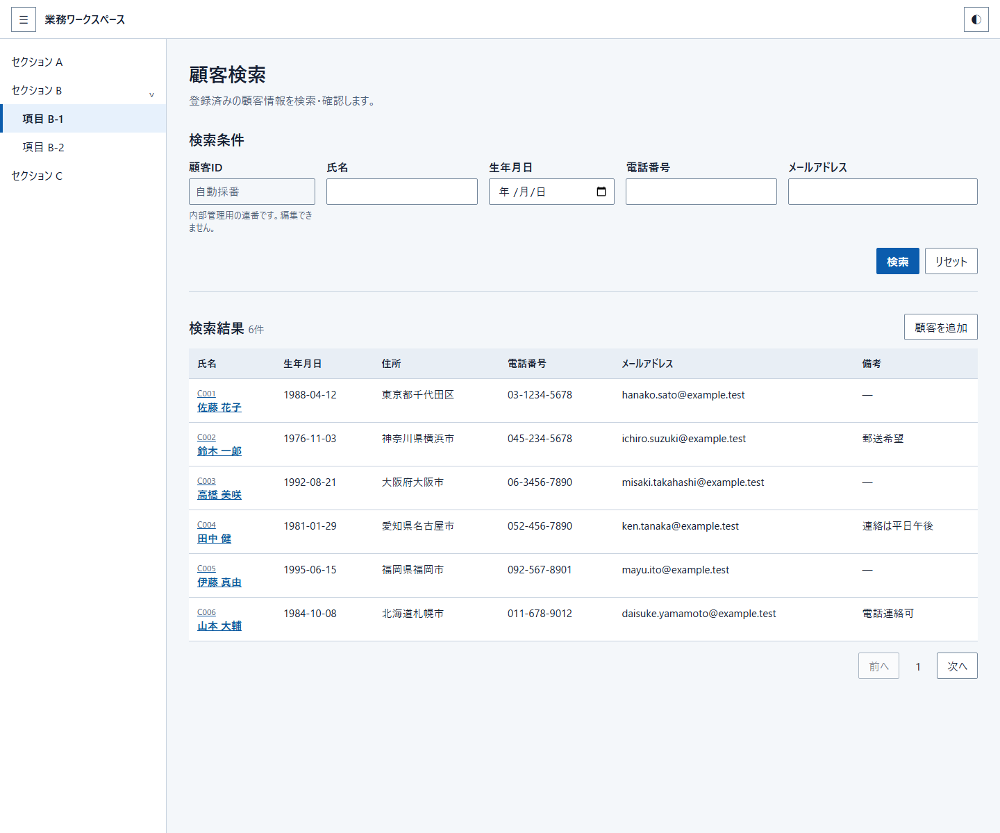
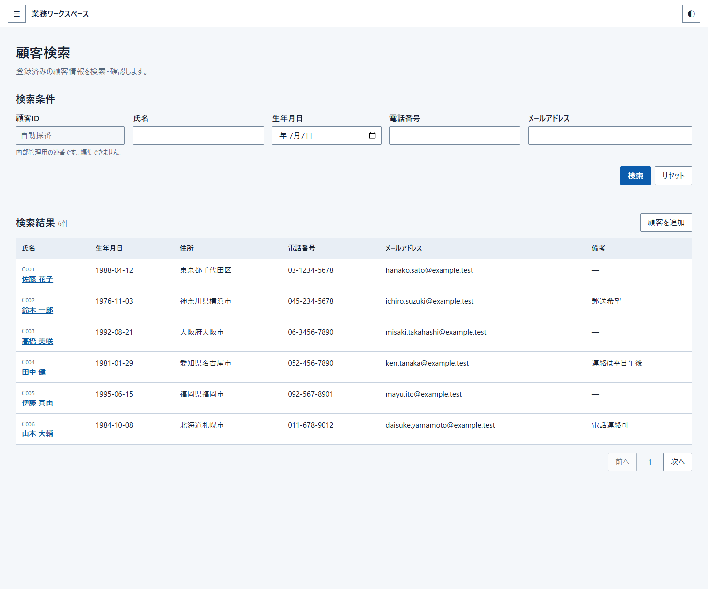
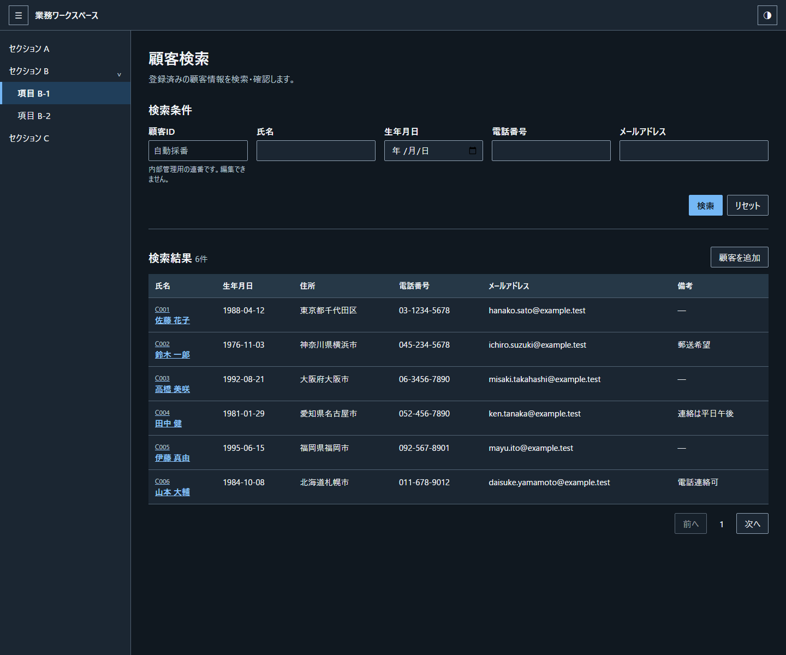
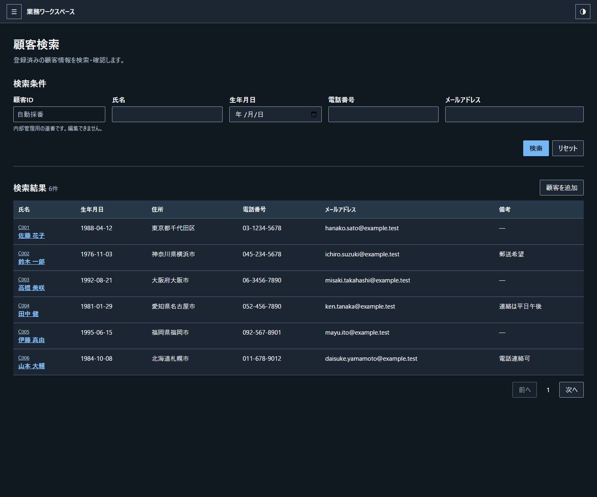
