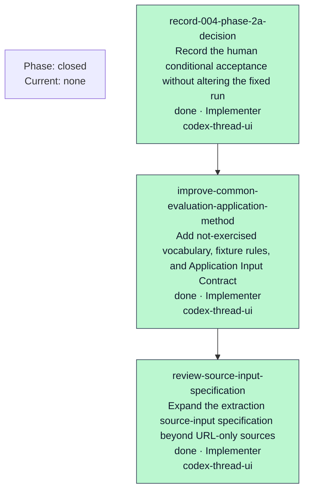

# Orchestration Progress

- Current phase: closed
- Current task: None
- Current worker thread: None
- Current transport: start=Unknown/Unknown, terminal=Unknown/Unknown, review=Unknown
- Last updated: 2026-07-22T01:04:36.819Z
- Last heartbeat: None
- Watchdog: inactive
- Slack notification: disabled
- Next action: CONDITIONALLY_ACCEPTED_CLOSED
- Current blocker: None
- Human gate: None

| Task | Status | Role | Surface | Start ACK/Receipt | Terminal/Receipt | Review | Attempt |
| --- | --- | --- | --- | --- | --- | --- | ---: |
| record-004-phase-2a-decision | done | Implementer | codex-thread-ui | received/sent | received/sent | accepted | 1 |
| improve-common-evaluation-application-method | done | Implementer | codex-thread-ui | received/sent | received/sent | accepted | 1 |
| review-source-input-specification | done | Implementer | codex-thread-ui | received/sent | received/sent | accepted | 1 |

