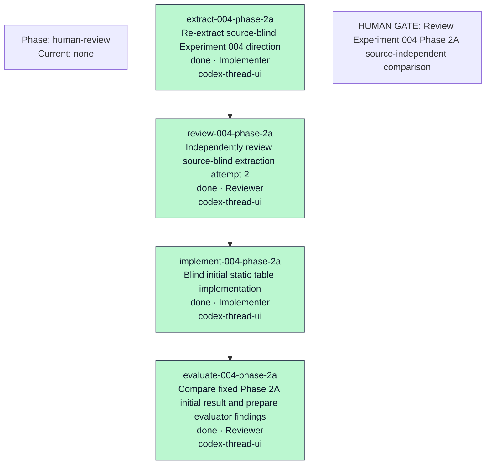

# Orchestration Progress

- Current phase: human-review
- Current task: None
- Current worker thread: None
- Current transport: start=Unknown/Unknown, terminal=Unknown/Unknown, review=Unknown
- Last updated: 2026-07-22T00:21:00.000Z
- Last heartbeat: None
- Watchdog: inactive
- Slack notification: Legacy
- Next action: HUMAN_REVIEW_REQUIRED
- Current blocker: None
- Human gate: [{"title":"Review Experiment 004 Phase 2A source-independent comparison","status":"human review required","artifact":"docs/poc/experiments/004-result-table-distillation/phase-2a-attempt-2/human-review.md"}]

| Task | Status | Role | Surface | Start ACK/Receipt | Terminal/Receipt | Review | Attempt |
| --- | --- | --- | --- | --- | --- | --- | ---: |
| extract-004-phase-2a | done | Implementer | codex-thread-ui | received/sent | received/sent | accepted | 2 |
| review-004-phase-2a | done | Reviewer | codex-thread-ui | received/sent | received/sent | accepted | 1 |
| implement-004-phase-2a | done | Implementer | codex-thread-ui | received/sent | received/sent | accepted | 1 |
| evaluate-004-phase-2a | done | Reviewer | codex-thread-ui | received/sent | received/sent | accepted | 1 |

