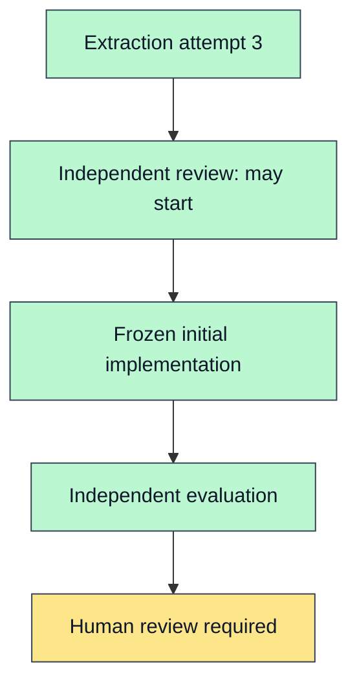

# Orchestration Progress

- Current phase: human review
- Current task: human-review-002-phase-2b1
- Current worker thread: none; all mechanical worker tasks are complete
- Current transport: all required ACK/report receipts recorded
- Last updated: 2026-07-22T03:10:00.000Z
- Watchdog: active until final regression checks and handoff complete (`phase-2b1-drawer-worker-watchdog`)
- Slack notification: disabled
- Next action: run final regression checks, then stop at `human review required`
- Current blocker: human decision
- Human gate: required

| Task | Status | Role | Surface | Start ACK/Receipt | Terminal/Receipt | Review | Attempt |
| --- | --- | --- | --- | --- | --- | --- | ---: |
| extract-002-phase-2b1 | ready_for_review | Extractor | codex-thread-ui | received/received | received/received | corrected and independently reviewed | 3 |
| review-002-phase-2b1 | ready_for_review | Independent reviewer | codex-thread-ui | received/received | received/received | `IMPLEMENTER_MAY_START=true` | 2 |
| implement-002-phase-2b1 | ready_for_review | Isolated Implementer | codex-thread-ui | received/received | received/received | frozen initial result | 1 |
| evaluate-002-phase-2b1 | ready_for_review | Independent evaluator | codex-thread-ui | received/received | received/received | human review material pending final checks | 1 |

